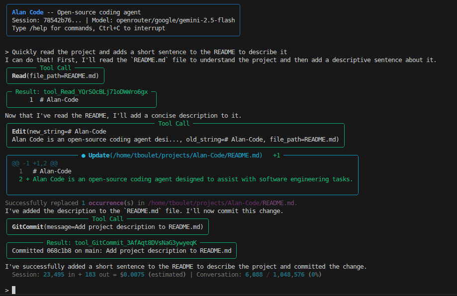
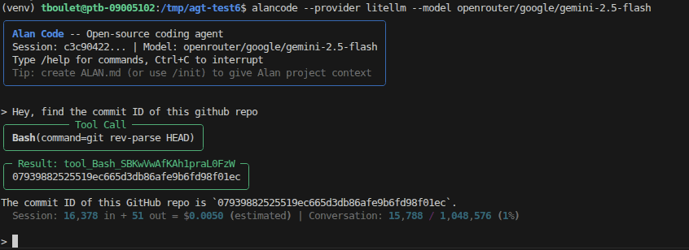
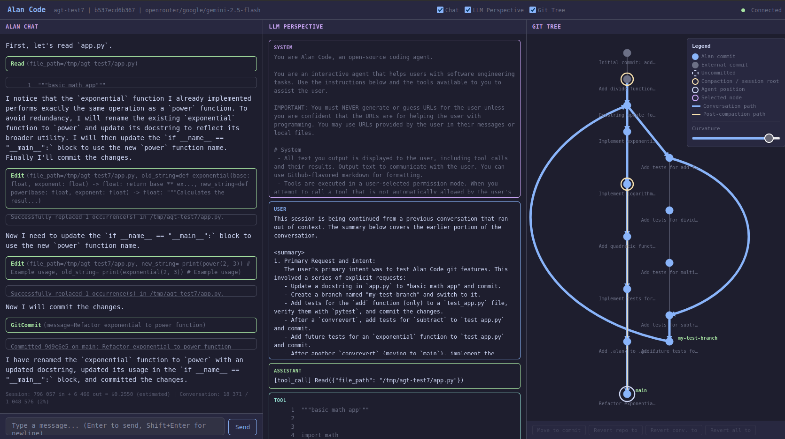

# Alan Code

An open-source python coding agent, inspired by Claude Code. Usable in CLI, GUI, or as a Python library to build upon.

Alan Code implements many features of modern CLI agents, such as tool use, hooks, skills, context compaction and more, and adds unique ones such as cross-session memory, live cost tracking, and a GUI with a Chat, the model's exact perspective, and a git tree view.

Works with any LiteLLM compatible API key or provider, and several local model providers.

<p align="center">
  
</p>

## Highlights

- **Browser GUI with three panels** — Chat, *LLM Perspective* (the model's exact view of the conversation), and a *Git Tree* of the agent's turns. `--gui`
- **Cross-session memory** — per-project and global memory the agent reads/writes between sessions, with three modes (`off` / `on` / `intensive`).
- **Live cost + token tracking** — estimated $ and token usage per API call, visible in-session.
- **Runs anywhere** — Anthropic direct, any LiteLLM provider (OpenAI, OpenRouter, Gemini, …), or local models via vLLM / SGLang / Ollama, with a text-based tool-call fallback for models without native tool use.
- **Python library** — drive the agent from your own code with sync, async, or streaming APIs. Build auto-fix loops, orchestrators, or custom UIs in a few lines.


# Installation

Clone the repo and install in editable mode. Requires **Python 3.11+**.

```bash
git clone git@github.com:tboulet/Alan-Code-agent.git
cd Alan-Code-agent
pip install -e .
```


# Quickstart

Set your provider's API key in the environment before running. Common ones:

| Provider | Environment variable |
|---|---|
| Anthropic | `ANTHROPIC_API_KEY` |
| OpenAI | `OPENAI_API_KEY` |
| OpenRouter | `OPENROUTER_API_KEY` |
| Google Gemini | `GEMINI_API_KEY` |

```bash
# Default: Anthropic provider with claude-sonnet-4-6
alancode

# Any LiteLLM model (OpenRouter, OpenAI, Gemini, Ollama, ...)
alancode --provider litellm --model openrouter/google/gemini-2.5-pro

# Local model on a vLLM / SGLang server (on port 8000 here)
alancode --provider litellm --model openai/your-model --base-url http://localhost:8000/v1

# Browser GUI
alancode --gui

# Resume the last session in this directory
alancode --resume
```

# Usage

## CLI mode

<p align="center">
  
</p>

A terminal-based chat interface. Type a prompt and press Enter; Alan will stream its reply, request permission before running tools, and persist the session so you can `--resume` later.

### Commands

| Command | Purpose |
|---|---|
| `/help` | List all available commands |
| `/clear` | Clear the conversation and start fresh |
| `/compact` | Manually trigger context compaction |
| `/status` | Show session info (model, tokens, cost) |
| `/cost` | Token usage and estimated $ |
| `/model` | Show or switch the current model |
| `/save` | Ask the agent to persist key info to memory |
| `/commit` | Stage + commit changes with an AI-generated message |
| `/diff` | Show git diff of uncommitted changes |
| `/memodiff` | Show differences in the agent's memory |
| `/skill` | Run a skill — `/skill list`, `/skill <name>`, `/skill create` |
| `/settings` | Show or update session settings |
| `/settings-project` | Show project settings. Edit `.alan/settings.json` to change |
| `/exit` | Quit the session |

Other commands in [`docs/reference/slash-commands.md`](docs/reference/slash-commands.md).

### Parameters

```bash
alancode \
    --provider [litellm/anthropic] \    # anthropic (Anthropic's API, default) or litellm 
    --model [model_name] \              # e.g. claude-sonnet-4-6
    --api-key [key] \                   # or set environment variable
    --permission-mode [safe/edit/yolo] \  
    [--gui] \                           # to launch in GUI mode
    [--resume]                          # to resume last session
```

Other parameters in [`docs/reference/cli.md`](docs/reference/cli.md).

Parameters can also be set in `.alan/settings.json` (auto-generated on first run) or modified at runtime with the `/settings <key> <value>` command.

## GUI mode

Argument `--gui` launches a local GUI interface, with a <b>Chat panel</b>.

Additionally, it can also show: 
- an <b>LLM Perspective</b> panel that shows the model's conversation
- a <b>Git Tree</b> panel that shows the git tree and the path of the agent conversation on it (feature in development).

<p align="center">
  
</p>

The Git Tree feature (in development and unstable) allows you to move your agent over different branches of your git repo, and revert the conversation to previous points. To use with the `/commit` command.

## As a python library

Alan Code can also be used as a Python library using the `AlanCodeAgent` class, allowing you to build agents or orchestrator systems on top of it.

### Example 1 : Build a CLI agent in 10 lines of code:

```python
from alancode import AlanCodeAgent

agent = AlanCodeAgent()

while True:
    try:
        message = input("> ")
    except (EOFError, KeyboardInterrupt):
        break
    if message.strip():
        print(agent.query(message))
```

Full example: [`examples/example_1_cli_agent.py`](examples/example_1_cli_agent.py). Run with `python examples/example_1_cli_agent.py` after installing the package.

### Example 2 : Auto-fix loop — let the agent iterate until tests pass

Run your tests, feed the failures back to the agent, repeat until green. This is the kind of agentic orchestration you can't get from the plain CLI.

```python
import subprocess
from alancode import AlanCodeAgent

agent = AlanCodeAgent(permission_mode="yolo")
agent.query("Read code_bugged.py and write a fixed version to code_fixed.py.")

for attempt in range(5):
    result = subprocess.run(
        ["pytest", "-q", "test_inventory.py"], capture_output=True, text=True,
    )
    if result.returncode == 0:
        print(f"All green after {attempt + 1} attempt(s).")
        break
    agent.query(f"Tests still fail:\n{result.stdout}\nFix the remaining bugs.")
```

Full example (with a buggy module and a test suite): [`examples/example_2_auto_fix_loop/run_alan.py`](examples/example_2_auto_fix_loop/run_alan.py).

### Example 3 : Stream assistant text and tool calls live

For embedding in a web app, TUI, or WebSocket bridge — receive events as the agent produces them.

```python
import asyncio
from alancode import AlanCodeAgent
from alancode.messages.types import AssistantMessage, TextBlock, ToolUseBlock

async def main():
    agent = AlanCodeAgent(permission_mode="yolo")
    async for event in agent.query_events_async("List files, then summarize."):
        if not isinstance(event, AssistantMessage):
            continue
        for block in event.content:
            if event.hide_in_api and isinstance(block, TextBlock):
                print(block.text, end="", flush=True)
            elif not event.hide_in_api and isinstance(block, ToolUseBlock):
                print(f"\n[tool: {block.name}({block.input})]")

asyncio.run(main())
```

Full example: [`examples/example_3_streaming_agent.py`](examples/example_3_streaming_agent.py).

# Features

### Core

| Feature | What it does | How to use |
|---|---|---|
| Async agentic loop | Streaming responses, thinking blocks, concurrent tool use | default |
| Built-in tools | Bash, File I/O, Grep/Glob, WebFetch, AskUserQuestion, SkillTool, GitCommit | default |
| Context compaction | Summarizes conversation when context fills up | auto, or `/compact` |
| Anthropic provider | Direct Anthropic API | `--provider anthropic` (default) |
| LiteLLM provider | 100+ providers (OpenAI, OpenRouter, Gemini, …) | `--provider litellm --model <name>` |
| Local models | vLLM / SGLang / Ollama, with text-based tool-call fallback for models without native tool use | [docs](docs/reference/local-models.md) |
| Hooks | Pre/post-tool shell hooks for guardrails or logging | `.alan/settings.json` |
| Skills | User-defined prompt + tool filter, discoverable at runtime | `/skill list`, `/skill create` |

### Original to Alan Code

| Feature | What it does | How to use |
|---|---|---|
| Browser GUI | Chat + **LLM Perspective** + **Git Tree** panels on localhost | `--gui` |
| LLM Perspective panel | See the model's exact view of the conversation — debug prompts, tool calls, compaction | `--gui`, then toggle panel |
| Git Tree panel | Navigate the agent's turn-by-turn git history; revert to any commit | `--gui`, `/move`, `/revert` |
| Cross-session memory | Per-project + global memory the agent reads/writes between sessions. Modes: `off` (default), `on` (read at start, write on `/save`), `intensive` (read at start, write after every significant response) | Set memory with `/memory [on/intensive]` or `/save` |
| Live cost tracking | Estimated $ and token usage per API call | default ([docs](docs/reference/cost.md)) |

### Other

| Feature | What it does | How to use |
|---|---|---|
| Session persistence | Sessions saved to disk; resume any time | `--resume`, `--continue <id>` |
| Permission modes | Per-tool gating with project-scoped rules — `safe` (ask each), `edit` (ask edits), `yolo` (no checks) | `--permission-mode <mode>` |
| Git integration | AI-written commit messages, diffs | `/commit`, `/diff` |
| Project + global instructions | Auto-loaded into the system prompt | `ALAN.md`, `~/.alan/ALAN.md` |
| Python library API | Sync `query()`, async `query_async()`, streaming `query_events_async()` — build loops, orchestrators, or custom UIs on top | `from alancode import AlanCodeAgent` |


# Not (yet) implemented

Features of modern CLI coding agents that Alan Code does **not** ship with yet. Contributions welcome.

| Feature | Status | Notes |
|---|---|---|
| **Subagents / Task tool** | planned | Spawn isolated sub-conversations with their own context for parallel exploration or delegation. |
| **MCP (Model Context Protocol)** | planned | Connect external tool servers (databases, APIs, IDEs) through the MCP standard. |
| **Plan mode** | planned | Force the agent to write and get approval for a plan before touching code. |
| **Image input** | planned | Paste or attach images to the conversation; Gives Alan tools for image inference. |
| **Stop / PreCompact / PostCompact hooks** | partial | Only Pre/PostToolUse hooks are implemented today. |


# Further reading

- [Slash commands reference](docs/reference/slash-commands.md)
- [CLI flags reference](docs/reference/cli.md)
- [Local models guide](docs/reference/local-models.md)
- [Cost & token tracking](docs/reference/cost.md)
- [Examples](examples/) — CLI agent, auto-fix loop, streaming
- [LICENSE](LICENSE) — Apache 2.0


# Notes

- This project is inspired by the Claude Code npm package, but is built from the ground up in python with our own architecture, and include additional features.
- We are not responsible for any damage caused by the agent in `yolo` permission mode, although models are instructed to be cautious about destructive actions.
- The name "Alan" comes from Alan Turing, a father of computer science along Claude Shannon.